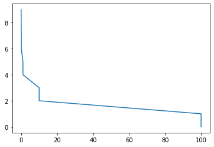

# Лекция 3

## Обуение нейронных сетей


```python
import torch
import torchvision
from torchvision import transforms
```


```python
from torch.utils.data import DataLoader, TensorDataset
```

### Нормировки

- установка общего масштаба перед обучением сетей


```python
transforms.Normalize(torch.tensor(0.286), torch.tensor(0.353))
```


    Normalize(mean=0.28600001335144043, std=0.3529999852180481)


- убрать симметрию для корректности весов нейронов
- убрать близость значений к 0 или 1
- одинаковая дисперсия, чтобы нейроны были __одинаковы__ с точки зрения интерпретации

Разные функции активации по-разному получают дисперсию градиентов(плохо - Sigmoid, ReLU - лучше).

Разные способы инициаллизации:
- домножение слева на матрицу в предположении НОРСВ начальных весов позволяет сохранить дисперсию(Рановмерная инициаллизация Ксавеьера)
- Для ReLU можно добиться аналогичного нормальными значениями w


```python
from torch import nn
```


```python
w = torch.empty(3, 5)

nn.init.uniform_(w, a=0.0, b=1.0), nn.init.normal_(w, mean=0.0, std=1.0)
```


    (tensor([[ 2.1235, -0.5777,  0.8965, -1.0561, -0.0611],
             [ 1.5458,  0.1807, -2.3971,  0.2327,  1.1289],
             [-1.2762,  0.3694, -0.4832,  1.0605,  1.1093]]),
     tensor([[ 2.1235, -0.5777,  0.8965, -1.0561, -0.0611],
             [ 1.5458,  0.1807, -2.3971,  0.2327,  1.1289],
             [-1.2762,  0.3694, -0.4832,  1.0605,  1.1093]]))


```python
nn.init.constant_(w, val=0.3)
```


    tensor([[0.3000, 0.3000, 0.3000, 0.3000, 0.3000],
            [0.3000, 0.3000, 0.3000, 0.3000, 0.3000],
            [0.3000, 0.3000, 0.3000, 0.3000, 0.3000]])


```python
nn.init.eye_(w)
```


    tensor([[1., 0., 0., 0., 0.],
            [0., 1., 0., 0., 0.],
            [0., 0., 1., 0., 0.]])


### Улучшение обучения

Методы, чтобы избежать переобучение:
- EarlyStopping(признаки переобучения => stop)
- mini-batches:
    - распараллеливание ускоряет обучение(меньше градиентов в ОП)
    - меньше случайности в градиентов(не SGD)
    - __Но доказательства об улучшениии сходимости нет__

__Эпоха__ - проход по всей обучающей выборке(все батчи пройти 1 раз)

- для обучения лучше, если линии уровня функционала ошибки - концентрицеские окружности

Методы для достижения этого качества:
- __Momentum__: $m^{t+1}=\rho m^t+\nabla L^t(w^t); w^{t+1}=w^t-\eta m^{t+1}$
    - Инерция помогает избежать локальных экстремумов и попасть в глобальные
- __м.Нестерова__: $m^{t+1}=\rho m^t+\nabla L^t(w^t-\eta m^t); w^{t+1}=w^t-\eta m^{t+1}$
- __Инерция помогает__:
    - когда линии уровня похожи на прямые
    - проскакивать седловые точки
- __Adagrad__: накапливание квадратов градиентов(чем больше градиенты, тем медленнее шаг) $v_i^{t+1}=v_i^t+(\nabla_i L^t(w^t))^2; w^{t+1}=w^t-\frac{\eta}{\sqrt{v_i^{t+1}+\epsilon}} m^{t+1}$
- __RMSprop__: добавление скользящего среднего к квадратам градиентов, регулируем влияние на скорость при росте градиентов;
- __Adam__: смесь RMSprop, Инерции и скользящего среднего. Добавляем кроме инерции параметр нормировки, его так же обновляем, влияем на шаг;
- __AdamW__: добавление слагаемого в обновлении весов(__?__)


```python
class Net(nn.Module):
    def __init__(self):
        super().__init__()
        self.fc = nn.Linear(2, 1)
        
    def forward(self, x):
        x = x.type(torch.FloatTensor)
        return self.fc(x)

model = Net()

X_ds = TensorDataset(torch.randint(high=10, size=(10, 2)),
                    torch.randint(high=10, size=(10, 1)))
X_dl = DataLoader(X_ds, batch_size=2, shuffle=True)

optimizer = torch.optim.Adam(model.parameters(),
                            lr=0.001,
                            betas=(0.9, 0.999),
                            eps=1e-08,
                            weight_decay=0,
                            amsgrad=False)

for input, target in X_ds:
    optimizer.zero_grad()
    out = model(input)
    loss = (out-target)**2
    loss.backward()
    optimizer.step() # Обновление весов
```

### Регуляризация(weight decay)

`torch.optim.SGD(..., weight_decay=0)`

__Weight decay__ - $\lambda$ регуляризатор для обновления весов нейронных сетей.
- чаще L2-регуляризация не нужно применять(другие методы лучше)

- __Dropout__: с вероятностью __p__ занюляются веса(выходы сети), тогда обучается часть сети, причем каждый раз разные фаргменты.
    - когда тестируется сеть, результат домножается на __(1-p)__, т.к. иначе будет слишком большое значение(научена сеть на другие результаты)
    - обоснования через __ансамбли__, __bayes__, __аугментация__, __робастность__
    - можно проверять уверенность сети после dropout через дисперсию результатов
    - __рецептивное поле__ нейронов улучшается через dropout
- __Inverted Dropout__: $y=\frac{1}{1-p}f(...)$, на тесте же $y = f(...)$
- __DropConnect__: удаляем сети, а не веса(домножаем на матрицу)

### Обрезка градиентов

- реуглировать длину шага в процессе обучения сети


```python
optimizer.zero_grad()

torch.nn.utils.clip_grad_norm_(model.parameters(), 200)
```


    tensor(0.)


### Батч-нормализация

- решает проблему __Covariate shift__:
    1. на каждой итерации меняем $w_{i, j}$;
    2. тогда меняются и значения предыдущих связей;
    3. изменение считалось из расчета известного маршрута для заданных весов;
    4. тогда вредят изменения весов - __проблема изменения распределения входов во время обучения__
    - Решение:
        1. Считаем статистики(среднего и дисперсии по мини-батчу - __статистики по обучающей выборке, не по текущим результатам(на случай теста)__);
        2. Нормируем данные и преводим к "нормальному" => __избегаем смещения__;
        3. Чтобы сохранить исходные распределения, домножим и сместим, введем эти параметры, тогда избегаем проблемы распределений.
    - Когда применять?
        - до слоев, после слоев, где угодно...
        - __в предыдущем линейном слое нужно отключить смещение(формула нормализации)__
    - Если используется BN, то лучше убрать Dropout, уменьшить регуляризацию, усложнить сеть;
    - Можно удалить из сети, изменив следующие слои.


```python
bn = nn.BatchNorm1d(10, eps=1e-5, momentum=0.1, affine=True, track_running_stats=True)

dp = nn.Dropout(p=0.1, inplace=True)

bn, dp
```


    (BatchNorm1d(10, eps=1e-05, momentum=0.1, affine=True, track_running_stats=True),
     Dropout(p=0.1, inplace=True))


```python
H = torch.arange(1, 17).reshape(4, 4).float()

drop = nn.Dropout(p=0.5)

H, drop(H)
```


    (tensor([[ 1.,  2.,  3.,  4.],
             [ 5.,  6.,  7.,  8.],
             [ 9., 10., 11., 12.],
             [13., 14., 15., 16.]]),
     tensor([[ 0.,  4.,  6.,  8.],
             [10.,  0., 14.,  0.],
             [18., 20.,  0.,  0.],
             [ 0.,  0.,  0.,  0.]]))


```python
bn = nn.BatchNorm1d(4, affine=False)

bn(H)
```


    tensor([[-1.3416, -1.3416, -1.3416, -1.3416],
            [-0.4472, -0.4472, -0.4472, -0.4472],
            [ 0.4472,  0.4472,  0.4472,  0.4472],
            [ 1.3416,  1.3416,  1.3416,  1.3416]])


### Аугментация данных

> Данные первичны, алгоритмы вторичны

- увеличение обучающей выборки используя преобразования, не меняющие характеристики объекта, при том не совпадающие с имеющимися
- __mixup__
- __cutout__
- __cutmix__


```python
import torchvision
```


```python
augmentations = transforms.Compose([
    transforms.Resize((224, 224)),
    transforms.ColorJitter(hue=.05, saturation=.05),
])
```

## Ансамблирование

- классическое ансамблирование(долго обучать, больше времени на inference)
- усреднение весов
- усреднение на разных эпохах(запоминают состояния, когда меняют lr)

## Проблемы НС

- численное сравнение производных и линейных интерполяций
- визуализация карты признаков и удаление попхожести
- данные(синтетическое изменение, проверка результатов)
- __lr__

Во время обучения:
- гистограммы весов;
- нормы градиентов;
- время обучения итераций

Пример:
- синтезировать голос:
    - обучений 1.5 дня;
    - через какое-то время должны начать прослеживаться _адекватные_ паттерны
    
lr:
- глубже сеть - меньше lr;
- меньше батч - меньше темп
- трансформеры - `1e-5`

- lr_scheduler


```python
model = nn.Linear(2, 1)
optimizer = torch.optim.SGD(model.parameters(), lr=100)
scheduler = torch.optim.lr_scheduler.StepLR(optimizer, step_size=2, gamma=0.1)
lrs = []

for i in range(10):
    optimizer.step()
    lrs.append(optimizer.param_groups[0]["lr"])
    scheduler.step()
```


```python
from matplotlib import pyplot as plt
```


```python
plt.plot(lrs, range(10))
```


    [<matplotlib.lines.Line2D at 0x12b290190>]


    

    


## Transfer Learning

- замораживаем веса сети и дообучаем только фрагменты сети

## Оптимизация гиперпараметров

- перебор по сетке
- __[DL]__ перебор по оптимизированной сетке(случайность, байесовские оптимизации и тд)


```python

```
