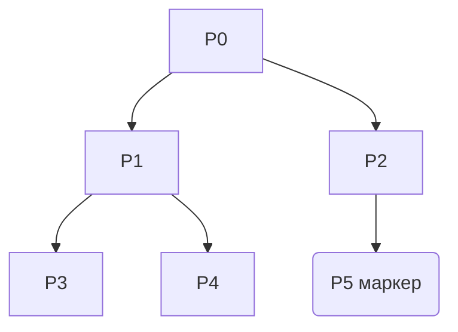

# Лекция №4

## Синхронизация в распределенных системах

Критерии децентрализованных алгоритмов:
- информация должна быть распределены среди множества ЭВМ;
- процесы должны принимать решения на основе локальной информации;
- устойчивы к сбоям;
- не должно быть предположений о глобальных часах;

__Итог__: не должно приниматься решение алгоритма в __одном__ месте.

### Синхронизация времени
#### Алгоритм Кристиана

$T_0, T_1$ отсчитываются по одним и тем же часам, тогда можем установить время запросов, зная время
обработки прерывания.

Проблемы:
- сбои влияют на общее предположение о работе систем;
- обработка влияет на время работы (не всегда 0, поэтому может произойти _рассинхрон_);

Решение:
- итерационно запрашивать обновление настройки часов.

#### Алгоритм Беркли

- есть _демон времени_, который обращается ко всем клиентам системы и рассылает часы каждому из них;
- каждый раз элементы системы сообщают о своем времени, на основе которого демон корректирует общее
  время;
  
Основная проблема:
- время может двигаться назад;

Пример проблемы:
- `make` работает на временных метках изменений файлов для более _умной_ перекомпиляции.

#### Логические часы. Lamport

- есть два события `A` и `B`. Нужно понять, когда каждое из событий произошло:
  - вводим отношение `a -> b`(a произошло до b) - _a произошло до b, с этим согласны все процессы_.
- тогда можно определить логические часы: Если `a -> b`, то `C(a) < C(b)`.

Алгоритм:
- С каждым событием в процессе $P_i$ увеличиваем часы $C_i -> C_i + d, d > 0$;
- Каждый раз берем вместо времени максимум из имеющегося времени и времени из сообщения(от другого
  процесса);
  
__Пример__:
- Есть 4 события: `A B C D` и 3 процесса;

1 -|A|-> 2 -|B|-> 3 -|C|-> 2 -|D|-> 1.

1. Сообщение A отправлено в момент вермени __6__, получено в __16__;
2. Сообщение B отправлено в момент времени __24__, получено в __40__;
3. Отправляем С в момент __60__, получено в __56__;
4. Отправляем D в момент __64__, получено в __54__.

Решение:
- Вводим логические часы:
  1. Как и ранее, но теперь у 2-го процесса метка __16__ > __16-6__ => __16__;
  2. Как и ранее и как в п.1;
  3. Отправляется С, но метка __60__ > __54__ => $C_c = 60+1=61$;
  4. Аналогично с D.

### Выборы координатора
- Есть множество процессов, нужно определить главного

#### Алгоритм задиры
- Координатор - процесс с максимальным номером;

1. Отправляем сообщения всем процессам с большими номерами, затем процесс _выборов_ продолжается;

__Пример__:
- есть 7 процессов, но 7-ой перестает работать:
  1. 4-ый процесс отправляет сообщение процессам __5, 6, 7__:
    1. __5, 6__ отвечают, что _живы_;
  2. __5-ый__ отправляет сообщение __6-му__, __6-ой__ __7-му__;
  3. затем процесс __6__ убеждается, что он теперь координатор.

#### Круговой алгоритм
- представляем процессы в виде кругового кольца;
- каждое сообщение содержит номер предшествующего процесса;
- в результате _выборов_ в начальную точку придет сообщение с номером координатора;
- затем отправить сообщение с номером координатора, чтобы каждый процесс запонил номер.

### Взаимное исключение

#### Централизованный алгоритм
- все процессы реализуют запросы через внутренню очередь координатора;
- координатор обрабатывает запросы и отвечает о разрешении работы запросов;
- после окончания работы процессов в критической секции, координатор меняет очередь и отправляет
  новое разрешение;

__Проблемы__:
- стандартные недостатки централизованного алгоритма.

#### Децентрализованный алгоритм на основе временных меток
- в обращение запроса в критическую секцию можем помещать время запроса;
- но теперь координатор должен раcсылать сообщение всем процессам(или не координатор);
- формирование очереди на основе временной метки запроса

Если всего $N$ процессов, то каждый раз нужно отправлять $N-1$ сообщение, причем на каждое из них
тратится $T_s + L \times T_b$, причем каждая отправка сопровождается ожиданием ответа от получателя

Раньше надо было $3\times (T_s+L\times T_b)$, теперь же $(N-1)\times (T_s + L\times T_b)$.

- когда процесс освобождает критическую секцию, он должен отправить соответствующее сообщение об
  освобождении секции.
- при наличии широковещательного механизма, вместо $N-1$ отправок можно организовать __одну__;

#### Алгоритм с круговым маркером
- по кольцу ходит маркер, дающий право на вход в критическую секцию;
- каждый раз процесс входит в критическую секцию, либо передает маркер дальше;

#### Широковещательный маркерный алгоритм(Suzuki-Kasami)

Маркер сохраняет:
- очередь запросов;
- масив с номерами последних удовлетворительных запросов.

- если процесс попадает в критическую секцию, запрос попадает в маркер;
- если процесс хочет попасть в критическую секцию, но не имеет в наличии маркера, то увеличивает
  номер своих запросов и посылает широковещательно сообщение "ЗАПРОС";

1. Каждый процесс нумерует свои запросы;
2. В широковещательное сообщение добавляется номер процесса(от которого идет запрос) и номер
   запроса;
3. Когда процесс получит сообщение-зарос от другого процесса, он установит в качестве метки максимум
   из полученного значения и имеющегося;
4. Когда критическая секция освобождается, то корректируются значения маркера и процесса.

----

__Пример__:
- 4 процесса и 4 вектора (0000);

1. Маркер в 3-ем процесса `NULL[очередь] | 0000[сколько успешных]`
2. 0-ой хочет попасть в критическую секцию и отправляет запрос(его RN = (1000));
3. У всех остальных меняются RN на (1000);
4. 1-ый и 2-ой выбывают далее(не участвуют);
5. 3-ий процесс обновляет NULL на 0 и передает маркер 0-му процессу(с обратной заменой);
6. 2-ой процесс тоже хочет попасть в критическую секцию (1000) -> (1010);
7. Все процессы обновляют RN на (1010);
8. 0-ой процесс закончил работу с 0-м процессом, обновляется LN (1000);
9. 0-ой процесс замечает отличие маркера с RN, замена NULL на 2 и т.д.

----

#### Алгоритм древовидный маркерный(Raymond)

- представляем процессы в виде двоичного дерева;
- каждый процесс хранит буфер с запросами - очередь процессов на вход в критическую секцию;
- если маркера в процессе нет, то добавляется процесс в очередь запросов и запрос в направлении
  владеня маркером(1 из 3-х путей - в корень, в правое поддерево или левое);

При получении запроса, либо продолжаем рекурентно вызов запроса маркера, либо исключаем 1-ый процесс
из очереди маркера и передаем маркер запрашиваемому.

1. Процесс P1 хочет получить маркер, формирует очередь;
2. Итерационно через корень попадет в процесс-держатель маркера P5;
3. Последовательно маркер попадает в P1.

