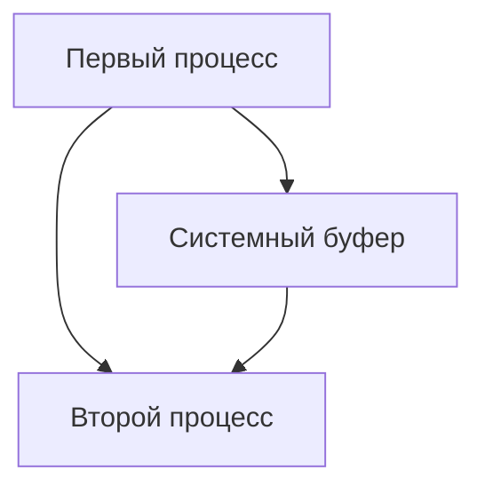
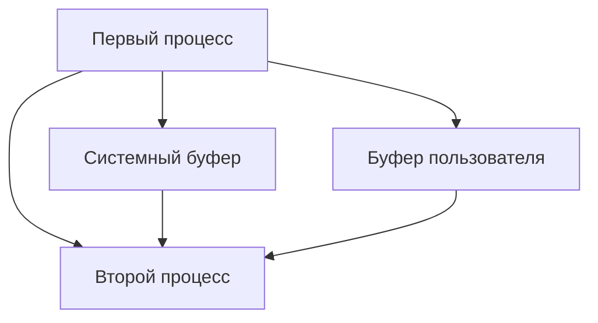

# Лекция №5

## MPI

> $T_s+N\times T_b$

- позволяет просто переходить с одной платформы на другую;

__Реализации MPI__:
- MPICH;
- LAM/MPI;
- Mvapich
- OpenMPI
- Intel, IBM e.t.c

> В некоторых реализациях возможно использовать адрес данных для ускорителя через MPI

### Реализация MPI

- __не обязательно__ реализовывать весь функционал MPI;
- можно использовать базовые конструкции, чтобы внедрить MPI-технологии;

### Модель MPI

- MPI реализует передачу сообщений между поточными процессами;

#### Основные понятия

- Для корректной отправки сообщения нужно:
  - Указать коммуникатор для передачи сообщений;
  - Группу процессов, куда данное сообщение передается.
- __Коммуникатор__ - упроавляющий объект, представляющий группу процессов, которые могут
  взаимодействовать друг с другом;
  - Создается, что определить _задачу_, в рамках которой работают процессы;
- __Сообщения__ характеризуются:
  - `adress`;
  - `count`;
  - `datatype`:
    - > реализует гетерогенность(универсальность работы независимо, например, от разрядности);
    - позволяет описывать сложные типы данных;
    - `MPI_CHAR, MPI_SHORT, ...`.
- __Тэг__ - определяемый пользователем признак для идентификации типа сообщения;
- Пример обработки ошибок на MPI(_наивный метод_):
  ```c++
  error = MPI_Init(&argc, &argv);
  if (error != MPI_SUCCESS) {
    fprintf(stderr, "MPI_Init error\n");
    return 1;
  }
  ```

#### Выполнение MPI-программы

- при запуске программы указываем требуемое число узлов для программы:
  ```bash
  mpirun -np 3 prog
  ```
  - После этого процессы нумеруются в порядке от __0 до 2__;
- можно узнать, была ли использована та или иная библиотека в mpi-программе 
  `MPI_Initialized(int *flag)`;
- для работы со временем используется `MPI_Wtime(void)`; 
  
__TODO: timer.cpp__ 
  
- в ходе выполнения программы можно получить статус любого сообщения;

### P2P обмен сообщениями

> Двухточечный обмен: один делает __send__, второй - __recieve__

- Когда отправляется сообщение, коммуникатор указывает на область видимость процессов-получателей:
  - P2P обмен возможен __только для процессов в одной области видимости__.
- Для успешного обемна P2P необходимо:
  - Правильный rank получателя, отправителя;
  - Достаточный объем буфера у получателя;
  - Одинаковый коммуникатор;
  - Совпадение тегов сообщений.

### Выполнение двхточечных обменов



__Недостаток подхода__:
- Системный буфер:
  - неизвестен объем;
  - выделение буфера под внутренним контролем MPI;

__Подход к улучшению__:


  
#### Разновидности P2P обмена

- блокирующий - __приостанавливают процесс во время получения или передачи сообщения__;
- неблокирующий - __прием и получение в фоновом режиме__.

#### Ошибки P2P

- Первым вызовом поставить блокирующее получение `MPI_Recv`, то программа бы зависла:
  - __Решение__: замена на неблокирующий `MPI_IRecv`, чтобы получение происходило в фоновом режиме.

#### Буферизованный P2P

- создаем пользовательский буфер и организуем взаимодействие процессов через него;

1. Регистрируем в MPI буфер `MPI_Buffer_attach(void* buf, int *size)`
2. Замена `MPI_Send` на `MPI_BSend` с теми же параметрами;
3. Извлекаем буфер из поддержки `MPI_Buffer_detach(coid *buf, int *size)`(вместе с этим гарантия,
   что все данные освобождены буфером);

**TODO: mpibuff.cpp**

#### Синхронный режим

- Вдобавок к сообщению отправляем служебное сообщение, что процесс-получатель готов;
- `MPI_Send` -> `MPI_SSend`

#### Режим по готовности

- операция завершается сразу же после отправки(не дожидаясь ответа).

### Совместный прием и передача

- `MPI_Sendrecv` - прием и передача с блокировкой;
- `MPI_Sendrecv_replace` - прием и передача с общим буфером.


