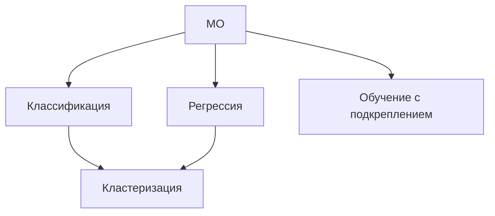

# Введение в МО

## Основные понятия

- $X, Y$ - множество объектов и меток, соответственно;
- Задача МО: найти проавильную зависимость $y: X \rightarrow Y$;
- __Примеры:__
  - Спам/не спам;
  - Классификация изображений.
- Множество объектов всегда переводится в специальное признаковое пространство $F$ - _умное_
  описание объектов;

### Алгоритмы МО

- нужно построить наиболее качественно описывающую точечную оценку для всех объектов;
- алгоритм решения должен эффективно реализовываться;

## Задачи МО



- Классификация - __конечное множество значений ответов__;
- Регрессия - __НЕ ФАКТ что конечное множество значений ответов__;
- Кластеризация - __Отнесение схожих объектов с неизвестной меткой к одним классам__;
- Обучение с подкреплением - __погружение алгоритма в детерминированную область с целью последующего обучения__;

### Классификация(вероятностная постановка)

- ММП найти распределение вероятностей принадлежностей объектов выбранным множествам, чтобы функция
  зависимости распределения была наибольшей(произведение вероятностей):
  - __Наивный байесовский классификатор__ - нужно найти наиболее вероятностное распределение:
    - Ищем максимизирующую вероятность принадлежности объекта конкретной метке, зная полученный
      объект и распределение(априорное) - _Апостериорное распределение из априорного_;
    - Применяется правило Байеса: $P(y|x) = \frac{P(x|y)*P(y)}{P(x)}$;
    - __Наивность__ - все признаки НОРСВ - _байес для бедных_ убирает знаменатель с интегралом и
      максимизируем только числитель;
      ```python3
      from sklearn.nayve_bayes import *

      corpus = [['list of ll'], ['class']]

      classifier = GaussianNB()

      vectorizer = CountVectorizer(ngram_range=(1, 2))
      y = corpus[1]
      X = vectorizer.fit_transform(corpus[0])
      classifier.fit(X, y)

      new_texts = ["texts"]
      feats = vectorizer.transform(new_texts)
      print(classifier.predict(feats))
      ```
  - __Линейная регрессия__ - найти параметры $a, b$ простой линейной модели $y = a\times x+b$ по имеющимся
    данным;
  - __Логистическая регрессия__ - аналогичный подход, но от регрессии переходим к классификации
    посредством добавления сигмоиды/softmax-функции: $p(x) = \frac{e^x}{e^x + 1}$;
  - __Кластеризация__ - объединение объектов в группы схожих по признакам:
    - __k-means__:
      1. вычисляем центроиды;
      2. сравниваем схожесть обновленных центроид:
        - если __совпало__, то останавливаем обновление(получили кластеры);
        - если __не совпало__, то повторяем запуск.
    
__Переобучение__ - эффект запоминания данных, а не извлечения особенностей(__плохо__);
__Борьба с переобучением__:
- делим данные на 3 множества - _тренировка_, _валидация_, _тест_;
- на валидации смотрим на качество в процессе обучения, поэтому можем скорректировать обучение в
  процессе.
  
  
## Подходы к МО

- вероятностные графические модели:
  - генеративные модели(объекты зависят от меток);
  - дискриминативные модели(метки зависят от объектов).
  - __пример__: 
    - классификация последовательностей(тексовые задачи);
    - вероятностное тематическое моделирование;
    - ансамблирование моделей;
- DL;
- байесовский подход(строим распределение, а не точечную оценку, выбираем самую вероятностную
  оценку);
  
> Больше данных - лучше результат.


