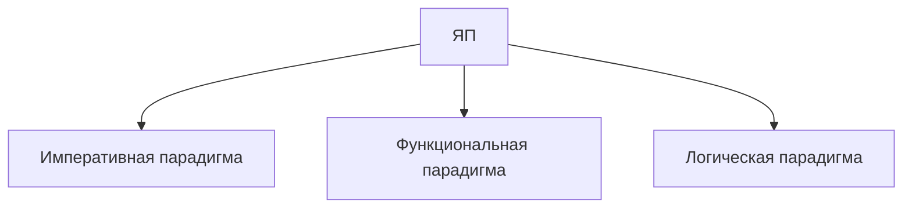
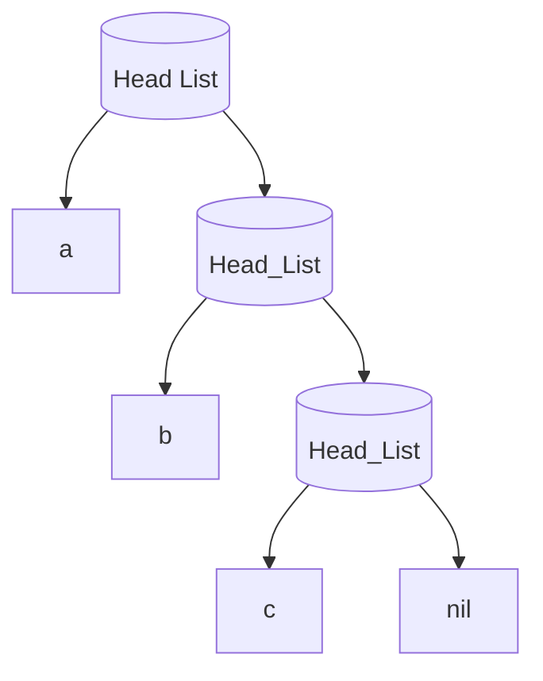

# Лекция № 7-8



## Функциональная парадигма

- Основные требования к языку:
  - Наличие функций;
  - Возможность рекурсии.
- Основная операция - __вызов(композиция) функций__
- Объекты 1-го порядка(аналог переменных в императивной парадигме) - функции(возможность создавать
  динамически функции);
- _Отсутствие хранимого состояния_;

__Языки__:
- FP(модельный язык);
- ML, Hope, Miranda, _Haskel_;
- Lisp:
  - изначально не задумывался, как язык функциональной парадигмы;
  - язык для NLP;
  - присутствуют различные парадигмы, в т.ч. императивная;
- CLOS.

- _минимальный_ язык;

Базис:
- скалярный(примитивные ТД и операции);
- стуктурный (составные ТД, операторы);

> Императивные языки с точки зрения Базиса почти не отличаются

Пример абстрактного типа данных в C - `FILE`;


### Lisp

Особенности Lisp:
- очень простой базис.

- Atom - символ или целая константа(произвольного размера)
- не хватает некоторых типов данных(строки и тд - в _простом_ варианте языка)

```lisp
ident 42 + NIL T 
ident 42 + () T //То же самое, NIL - атом и одновременно пустой список

// () == False
```

> Весь базис языка на _одной_ страничке

- Главная структура данных - S-выражение:
  - S-выражение => атом | точечная пара
  - Точечная пара => (S-выражение . S-выражение)
  - Пример:
    - (a . b) (nil . abc) (nil . nil) (a . (b . c))
  - Каждый элемент(из пары) __либо атом__, __либо указатель на пару__.
- Список - рекурсивная структура данных, определяемая в процессе S-выражение.
- Первый элемент списка - голова(атом), второй - список.



- REPL(read - evaluate - print - loop):
  - Atom-целое => в себя;
  - Пустой список => в себя;
  - Atom-символ => в свое значение;
  - Список:
    1. вычисление аргументов;
    2. отождествление с формальными парметрами функции.

Стандартные функции:
- `CAR S` - возвращает __голову точечной пары__ списка S:
  - `QUOTE` - специальная форма - __отменяет вычисление аргумента__:
    - `(CAR (QUOTE (A B C))) == A`;
    - `(CAR '(A B C)) == A`.
- `CDR S` - возвращает __хвост списка__;
- `CONS A B` - возвращает __точечную пару__ `A | B`.
- `(IF B S1 S2)`:
  ```mermaid
  graph TD;
    A[B] -->|"!=()"| S1
    A -->|"==()"| S2
  ```
  `NULL S` True, если S == (), иначе NIL
  
__Reverse__:
```lisp
(print(reverse(read)))

(print(reverse '(ABC)))
```

- `(defun f arglist S)` - создание функционального символа __f__ с списком аргументов __arglist__,
  телом функции __S__.
  
__Reverse 1__:
```lisp
(defun reverse1(s)
  (if (null s)
    s
    (append (reverse1 (cdr s)) (cons (car s) ()))
  )
)

(append (reverse1 (cdr s)) (car s)) //Будет ошибка, т.к. car s не список
```

__Reverse 2__:
```lisp
(defun shift(l r)
  (if (null l)
     r
     (shift (cdr l) (cons (car l) r))
  )
)

(defun reverse1(s) (shift s nil))
```

### REFAL - Recursice Functions Algorithmis Language

- Функция имеет только аргумент поле ввода(последовательность символов), тело функции:
  - пердложения вида $\alpha = \beta$;
  - если совпало $\alpha$, то выполняется $\beta$.
> REFAL - реализация нормальных алгориФмов Маркова

Примерная идея:
```
Polyndrom
{
              = "Yes"/;
  s.1         = "Yes"/;
  s.1 e.1 s.1 = <Polyndrom e.1>/;
  e.1         = "No"/;
}
```

Reverse:
```
$ENTRY Go
{
  = <Prout <Reverse1 <Card>>>/;
}
Reverse1
{
  s.1 e.1 = <Reverse1 e.1> s.1/;
  = \;
}
```

## Логическая парадигма(язык Пролог)

- Скалярный базис:
  - константы:
    - атомы(символы со строчной буквой вначале, так же литералы);
    - числа(123)
  - переменные(переменные с просписной буквой вначале, либо _x).
- Структурный базис - списки;
- Программа на прологе - описание предикатов(и описание фактов):
  - Предикат оканчивается точкой;

  ```
  man(sokrat).
  mortal(X):-man(X).
  
  ?-mortal(sokrat).
  true.
  ?-mortal(igor)
  false.

  ?-mortal(X).
  X=sokrat.
  ```

__Reverse__:
```
reverse1([], []).
reverse1([X|Q], Z):-reverse1(Q, Y), append(Y, [X], Z).
?-reverse1([1, 2, 3, 4], _)
true.

?-reverse1([1, 2, 3, 4], _x)
_x=[4, 3, 2, 1].
```

__Reverse1__:
```
shft([], X, X).
reverse2(X, Y):-shft(X, [], Y).
shft([H|T],R,Z):-shft(T,[H|R],Z).
```


